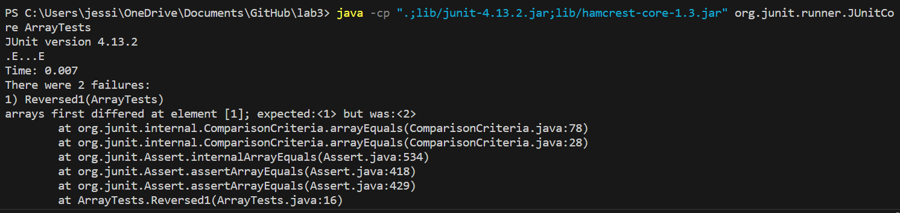
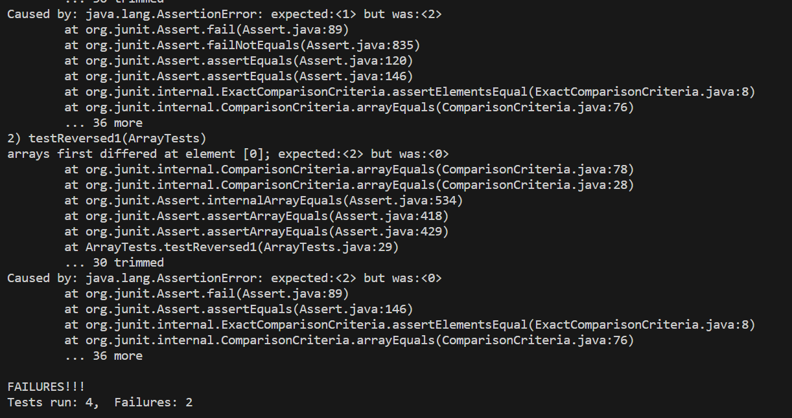
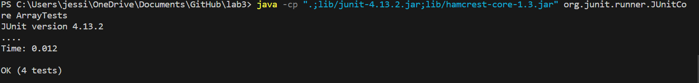
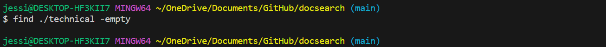
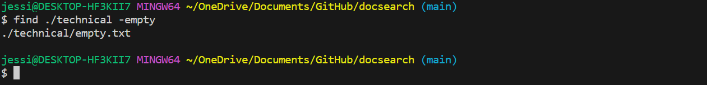
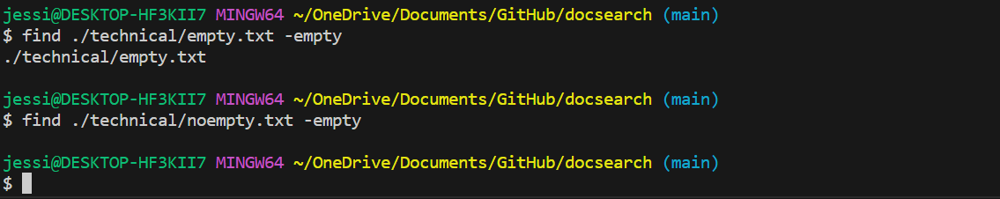
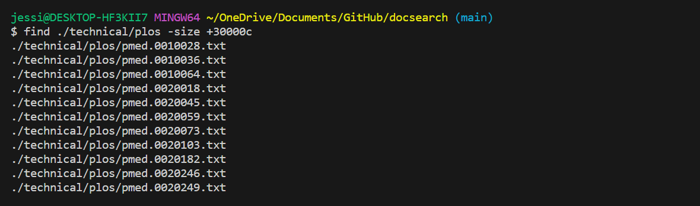
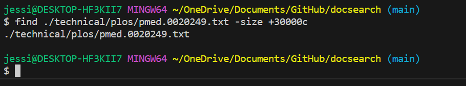

## Part 1:

I do the ArrayExamples for Part1. At first, I add two new Junit tests to test the code, but both of them fail. 

```
@Test
public void Reversed1() {
    int[] input1 = {1,2};
    ArrayExamples.reverseInPlace(input1);
    assertArrayEquals(new int[]{2, 1}, input1);
}

@Test
public void testReversed1() {
    int[] input1 = {1,2};
    assertArrayEquals(new int[]{2,1 }, ArrayExamples.reversed(input1));
}
```
Two of the given Junit tests did not fail.
```
@Test 
public void testReverseInPlace() {
    int[] input1 = { 3 };
    ArrayExamples.reverseInPlace(input1);
    assertArrayEquals(new int[]{ 3 }, input1);
}

@Test
  public void testReversed() {
    int[] input1 = { };
    assertArrayEquals(new int[]{ }, ArrayExamples.reversed(input1));
  }
  ```
The failing out put in the terminal looks like the following images:




After I fix the code, the out put of Junit test is like the following image:



The code with bugs is looks like:
```
public class ArrayExamples {

  // Changes the input array to be in reversed order
  static void reverseInPlace(int[] arr) {
    for(int i = 0; i < arr.length/2; i += 1) {
      arr[i] = arr[arr.length - i - 1];
    }
  }

  // Returns a *new* array with all the elements of the input array in reversed
  // order
static int[] reversed(int[] arr) {
    int[] newArray = new int[arr.length];
    for(int i = 0; i < arr.length; i += 1) {
      arr[i] = newArray[arr.length - i - 1];
    }
    return arr;
  }
```

The code after I fix it is:
```
public class ArrayExamples {

  // Changes the input array to be in reversed order
  static void reverseInPlace(int[] arr) {
    for(int i = 0; i < arr.length/2; i += 1) {
      int a = arr[i];
      arr[i] = arr[arr.length - i - 1];
      arr[arr.length - i - 1] = a;
    }
  }

  // Returns a *new* array with all the elements of the input array in reversed
  // order
  static int[] reversed(int[] arr) {
    int[] newArray = new int[arr.length];
    for(int i = 0; i < arr.length; i += 1) {
      newArray[i] = arr[arr.length - i - 1];
      newArray[arr.length - i - 1] = arr[i];
    }
    return newArray;
  }
```
For the reverseInPlace(int[] arr), I found that it only change the first half of the array to reverse order, but the second half still remaind the same. Therefore, in order to change the code, we need to also change the second half of the numbers. So I use an int a to store the array number in i position, and then after it change to equal to arr[i] = arr[arr.length - i - 1], I also change arr[arr.length - i - 1] = a, so in this case, the whole array could change in reverse in place correctly. 

For the reversed(int[] arr), I found that it wrote the same as reverseInPlace(int[] arr) and return the original array instead of the new array we create. So, I wrote the new array i position number equal to the number of original array in arr.length - i - 1 position, and similarly to wrote the new array arr.length - i - 1 position number equal to the number of original array in i position. 
newArray[i] = arr[arr.length - i - 1];
newArray[arr.length - i - 1] = arr[i];
In this way, the numbers in the arr will place in a reverse order in newArray correctly. And lastly return the newArray with the reverse order of arr.

## Part2

I chose find command for lab report Part 2. (All of the methods are find at https://www.geeksforgeeks.org/find-command-in-linux-with-examples/)

The first one interested find command option is find [directory] -empty. This method find the empty files and directory in the directory we enter. So I test on ./technical with the command 'find ./technical -empty', it did not have any file or directory appear. Therefore, I assum that there might not have empty file under the ./technical directory.



However, in order to check whether the empty command work as same as I expected, I create a empty txt file called empty under the technical directory. So I call the command 'find ./technical -empty' again, the file empty.txt appear with the whole address. 



Therefore, If there is a directory, it will check the next level files and directory to see whether there are empty files or directory exist. I also test on file. I test on enter the file instead of directory for find command. I enter 'find ./technical/empty.txt -empty' on my terminal, and it also return ./technical/empty.txt since it is empty. I also create a file called noempty.txt which is not empty. I enter 'find ./technical/noempty.txt -empty' on my terminal, It return nothing. 


This means that the empty option on find command not only check the directories and files in next level of the directory we enter, also check the directory level we enter. It is useful if we know that there is a lot of files under a directory and we need to find whether there are empty files exist. It is convinience and we do not need to open each file to check, one command is enough. 

The second find command option I found is 'find [directory] -size Nc'. N is the number we can enter. This command help people to find the number of charactors of all the files under the direcctory. If add a + in front of N, like 'find [directory] -size +Nc', it means that find all the files under the enter directory that have more than N charactors. Similarly, if add a - in frond of N, 'find [directory] -size -Nc', it will help us to find all the files under the enter directory that have less tan N charactors.



In the picture, that is all the files that have greater than 30000 charactors under the directory ./technical/plos. Now we know that this option works for directory, so we need to check whether it will also works on a file. I enter one of the files with greater than 30000 charactors as the enter directory, and it shows the same file directory as enter, which shows that it can also work to check the single file. 



It is really useful when we have large number of txt files but did not know how many words they have, we can use this command to filter which files meet the requirement of words counts and which files did not. It save a lot of time to avoid to open each files to count the words.
